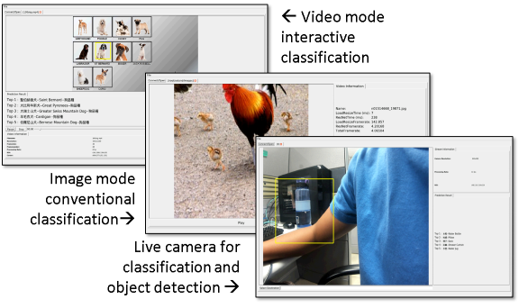

## Prebuilt DLA System on ZCU102 or ZCU104

------------------

### Prebuilt Applications

1.  Live camera objection detection (Tiny YOLO), classification (Resnet50)

2.  Interactive video classification, click mouse to identify

3.  Conventional image classification

* **DLA SPEC :** 64-MAC NV_small, 128kB, 150MHZ

--------------------------
### Software Requirements

*  Vivado&reg; Design Suite 2018.3
*  PetaLinux Tools 2018.3

### Hardware Requirements

*  ZCU102 Evaluation Board or ZCU104 Evaluation Board
*  An Full-HD monitor (1920x1080) with displayport(DP) 
*  A DP cable (if you'd like to use VGA or HDMI converter, be aware of the compatibility)
*  USB Adapter and USB Hub
*  USB Mouse and USB Webcam
*  A desktop/laptop + USB cable for UART control (optional)

--------------------------
### Build an SD image by yourself

* Prepare an SD or micro-SD card, >= 16GB is preferred.
* Divide the SD card with 2 partitions.
* The 1st partition is the FPGA design and system boot image (BOOT.BIN & image.ub).
* The 2nd partition (ext4 format) is the media parts that in the current directory.
* After the system being booted, change to the Prebuilt/resnet_tiny-yolov1 folder, use rvm command to execute QT GUI.

       % cd your_path/resnet_tiny-yolov1
       % ./rvm –platform linuxfb
 
--------------------------
### Directly Apply for the prebuilt SD image, to plug and play

* Once you find problem to build the system, you may apply for the prebuilt SD card image for quick demos.

    * The system image is about 5GB after compression.

    * You may send your request to scluo@itri.org.tw, with following info.

      *  Email title: 【Try DLA】YourID 
      *  Email contents: 
      
              Repeat your ID  (Title, Name)
              Affiliation (Company or School) 
              Required FPGA platform : ZCU102 or ZCU104 
              Brief introduction of your project

  *  We will send you the link through google drive or ITRI file delivery system.

  *  Also, if you are local, welcome to visit us for more information.

----------

### Documents

*  [Petalinux Building Tutorial](./doc/Petalinux%20Tutorial/petalinux_tutorial.pdf)

*  [Demo GUI user guide](./doc/Demo%20Start!/Demo%20Start.pdf)
