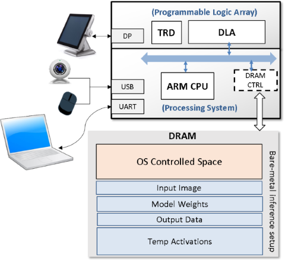
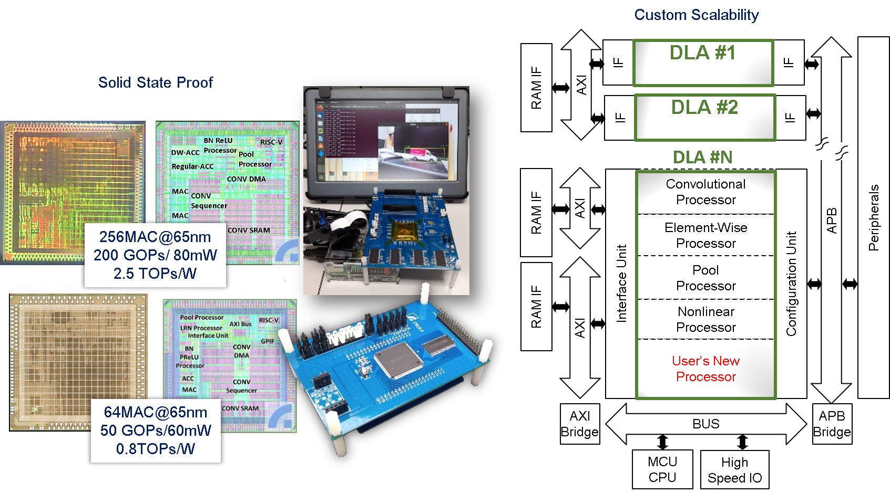

## ITRI-OpenDLA 
About more information, please visit our [public demos and introductions](https://sites.google.com/view/itri-icl-dla/)

<<<<<<< HEAD
About more information, please visit our public publications.

- [AI系統晶片解決方案](https://ictjournal.itri.org.tw/content/Messagess/contents.aspx?PView=1&KeyWord=&SiteID=654246032665636316&MmmID=654304432061644411&SSize=10&MSID=1037365742473466171 )，電腦與通訊2020
- [NVDLA軟硬體整合歷程](https://ictjournal.itri.org.tw/content/Messagess/contents.aspx?PView=1&KeyWord=&SiteID=654246032665636316&MmmID=654304432061644411&SSize=10&MSID=1037365734414623040 ) ，電腦與通訊2020

- [Customization of a Deep Learning Accelerator](/papers/DLA_VLSI_DAT19.pdf) ， VLSI-DAT 2019
- [Configurable Deep Learning Accelerator with Bitwise-accurate Training and Verification](/papers/DLA_VLSI_DAT22.pdf)，VLSI-DAT 2022

=======
Express open-DLA implementation kit for FPGA demo, revised based on [NVDLA](http://nvdla.org/index.html)
>>>>>>> b862a50a2da1cb11cd09051aae0d4d6530be6023

### Contents
- **FPGA_RTL\_nvsmall64** contains the source RTL codes that are revised for FPGA implementation.
- **Prebuilt** contains prebuilt and quantized DNN models (Resnet & Tiny YOLO) for standard application demos.
- **nvsmall64_zcu104** contains the Vivado project for Xilinx MPSOC ZCU104 board.
- **nvsmall64_zcu102** contains the Vivado project for Xilinx MPSOC ZCU102 board.

### About ITRI 
- [**ITRI**](https://www.itri.org.tw/) (Industrial Technology Research Institute), founded since 1973, is Taiwan’s largest research institutions.

### About DLA
- **DLA** (Deep Learning Accelerator), is a flexible DNN processing engine opened by NVDIA. We have revised this open source with several features, including the support of MobileNet Series, weight decompression of convolution / fully-connected operations, and various customize options for users. However, abovementioned revisions are under our commercial license, not inside this open project. This project is a basic revision that is close to the original open-source version.

### Our Purpose
- The OpenDLA here is the basic one, 64-MAC version, which is originally named nv_small in NVDIA's open source. Here we provide the synthesizable codes and project files for popular Xilinx MPSOC FPGA Series. We hope this may create an easy entrance for DNN edge implementation whether in academic or industrial. Also, this can be a fast way to evaluate our services. 

### Implementation Examples
[Introduction Presentation](/papers/IntroPresentation.pdf)

