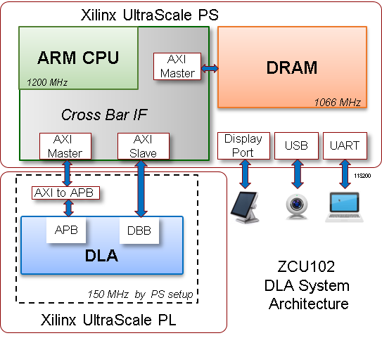

# nvsmall64\_zcu102 
----------

64-MAC DLA implementation on the Xilinx ZCU102 Board. 

The project is based on Zynq UltraScale MPSoC Base TRD 2017.4. Default DLA frequency is set to 150 MHz.

DEV References: 

+ [Xilinx UltraScale MPSOC TRD 2017.4](https://xilinx-wiki.atlassian.net/wiki/spaces/A/pages/18842199/Zynq+UltraScale+MPSoC+Base+TRD+2017.4)

------------
## Contents
- conv\_8x8\_3x3\_fc\_ic32\_oc32: test program of a convolution operation
- dla_copy: test program of a data movement
- doc: documentation
- a38\project_1.sdk\zcu102_base_trd_wrapper_hw_platform_0\zcu102_base_trd_wrapper.bin: the vivado project bitstream
- a38\project_1.sdk\SD_BOOT\bootimage\BOOT.bin: SD Card Boot.bin

---------------------

## Hardware Requirements

- ZCU102 evaluation board (rev 1.0 or rev D2)
- Display Port cable (DP certified) 
- Micro-USB cable (UART terminal)
- USB3 micro-B adapter + HUB
- USB mouse
- SD card
- USB webcam (optional)

## Software Requirements

Reference: [Xilinx UG1144](https://www.xilinx.com/support/documentation/sw_manuals/xilinx2018_3/ug1144-petalinux-tools-reference-guide.pdf)

- Linux host machine for all tool flow tutorials
- PetaLinux Tools version 2018.3
- Silicon Labs quad CP210x USB-to-UART bridge driver
- Terminal for serial UART control

------------------

## To Build

### Environment Setup

1. Clone the repository **FPGA_RTL_nvsmall64** to your directory
1. Create Vivado Project or using TRD 2017.4
1. Open Vivado Project --> Settings --> IP --> Repository --> Add above **FPGA_RTL_nvsmall64** path

### Running Bitstream using SD Card

1. Open Xilinx SDK 2018.3 Tool
1. Workspace assign a38\project_1.sdk
1. Copy **a38\project_1.sdk\SD_BOOT\bootimage\BOOT.bin** to a Micro SD card
1. Setup the FPGA switches to : SD Boot Mode

###  Run the test bench: dla\_copy  

Test Program Description:  the program transfers data(Image_q_dog_HW.bin ) from 0x40000000(Source) to 0x40200000(Destination), and then compare the data of 0x50000000 (Golden) with the data of 0x40200000(Destination).

1. Use a JTAG cable to download bin file to DRAM 
1. SDK :Xilinx --> Restore Memory --> Image_q_dog_HW.bin to Start Address : 0x40000000 (Source)
1. SDK :Xilinx --> Restore Memory --> Image_q_dog_HW.bin to Start Address : 0x50000000 (Golden) 
1. Run the **dla_copy** test program
1. Compare and check 0x40200000(Destination) and 0x50000000(Golden)
1. If success, a “DLA Copy Test Success” message will show in the terminal 
  

### Run the test bench: conv\_8x8_3x3\_fc\_ic32\_oc32

Test Program Description: the program executes a convolution operation and generate OFM : 6x6x32 at 0x40080000, and then compare the data of 0x40080000(OFM) with the data of 0x50000000 (Golden OFM).

1. Use a JTAG cable to download bin file to DRAM
1. SDK :Xilinx --> Restore Memory --> CONV_SDP_0_input.bin to Start Address : 0x40000000 (IFM)
1. SDK :Xilinx --> Restore Memory --> CONV_SDP_0_weight.bin to Start Address : 0x40040000 (Weight)
1. SDK :Xilinx --> Restore Memory --> CONV_SDP_0_output_golden.bin to Start Address : 0x50000000 (Golden OFM)
1. Running the **conv\_8x8\_3x3\_fc\_ic32\_oc32** test program
1. Compare and check 0x40080000(OFM) and 0x50000000(Golden OFM)
1. If success, a “Convolution Test Success” message will show in the terminal
