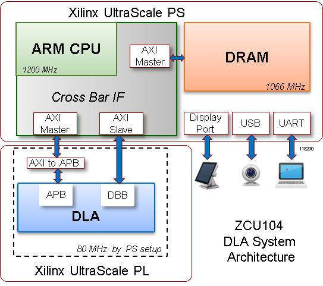

# nvsmall64\_zcu104 
----------

64-MAC DLA implementation on the Xilinx ZCU104 Board. 

This project is based on Xilinx ZCU104 V2 BSP. Default DLA frequency is set to 80 MHz.

DEV References: 

+ https://www.xilinx.com/support/download/index.html/content/xilinx/en/downloadNav/embedded-design-tools/2018-3.html
+ https://www.xilinx.com/member/forms/download/xef.html?filename=xilinx-zcu104-v2018.3-final-v2.bsp

------------
## Contents
- **conv\_8x8\_3x3\_fc\_ic32\_oc32:** test program of a convolution operation
- **dla_copy:** test program of a data movement
- **doc:** documentation
- e38\project_1.sdk\design_1_wrapper_hw_platform_0\\**design_1_wrapper.bit:** the vivado project bitstream
- e38\project_1.sdk\SD_BOOT\bootimage\\**BOOT.bin:** SD Card Boot.bin

-------------
## Hardware Requirements

- ZCU104 evaluation board
- Display Port cable (DP certified) 
- Micro-USB cable (UART terminal)
- USB3 micro-B adapter + HUB
- USB mouse
- Micro SD card
- USB webcam (optional)

## Software Requirements

Reference: [Xilinx UG1144](https://www.xilinx.com/support/documentation/sw_manuals/xilinx2018_3/ug1144-petalinux-tools-reference-guide.pdf)

- Linux host machine for all tool flow tutorials
- PetaLinux Tools version 2018.3
- Silicon Labs quad CP210x USB-to-UART bridge driver
- Terminal for serial UART control

---------------------

## To Build

### Environment Setup

1. Clone the repository **FPGA_RTL_nvsmall64** to your directory
1. Create Vivado Project or using Xilinx ZCU104 V2 BSP
1. Open Vivado Project --> Settings --> IP --> Repository --> Add above **FPGA_RTL_nvsmall64** path

### Running Bitstream using SD Card

1. open Xilinx SDK 2018.3 Tool
1. Workspace assign a38\project_1.sdk
1. Copy **e38\project_1.sdk\SD_BOOT\bootimage\BOOT.bin** to a micro SD card
1. Setup the FPGA switches to : SD Boot Mode

###  Run the test bench: dla_copy  

Test Program Description:  the program transfers data(Image_q_dog_HW.bin ) from 0x40000000(Source) to 0x40200000(Destination), and then compare the data of 0x50000000 (Golden) with the data of 0x40200000(Destination).

1. Use a JTAG cable to download bin file to DRAM 
1. SDK :Xilinx --> Restore Memory --> Image_q_dog_HW.bin to Start Address : 0x40000000 (Source)
1. SDK :Xilinx --> Restore Memory --> Image_q_dog_HW.bin to Start Address : 0x50000000 (Golden) 
1. Run the **dla_copy** test program
1. Compare and check 0x40200000(Destination) and 0x50000000(Golden)
1. If success, a “DLA Copy Test Success” message will show in the terminal 
  

### Run the test bench: conv\_8x8_3x3\_fc\_ic32\_oc32

Test Program Description: the program executes a convolution operation and generate OFM : 6x6x32 at 0x40080000, and then compare the data of 0x40080000(OFM) with the data of 0x50000000 (Golden OFM).

1. Use a JTAG cable to download bin file to DRAM
1. SDK :Xilinx --> Restore Memory --> CONV_SDP_0_input.bin to Start Address : 0x40000000 (IFM)
1. SDK :Xilinx --> Restore Memory --> CONV_SDP_0_weight.bin to Start Address : 0x40040000 (Weight)
1. SDK :Xilinx --> Restore Memory --> CONV_SDP_0_output_golden.bin to Start Address : 0x50000000 (Golden OFM)
1. Running the **conv\_8x8\_3x3\_fc\_ic32\_oc32** test program
1. Compare and check 0x40080000(OFM) and 0x50000000(Golden OFM)
1. If success, a “Convolution Test Success” message will show in the terminal

